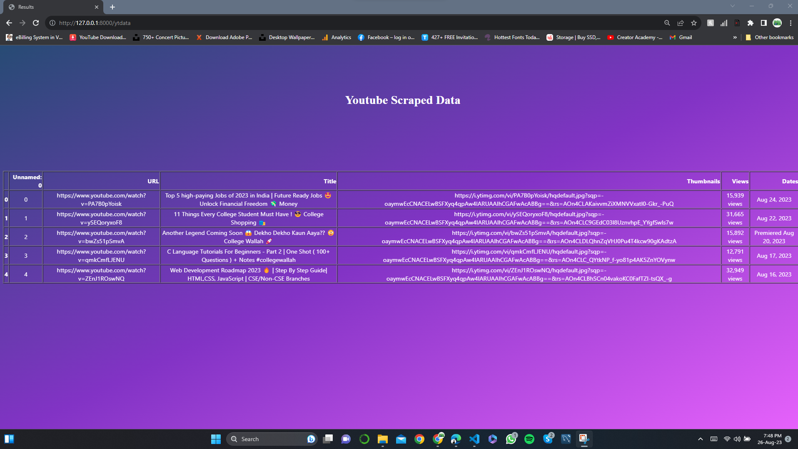

# YouTube-Scraping-Project

## This is YouTube Scrapper Project Assigment By Neeraj Prasad.

# WebApp Homepage Screenshot

# Youtube Handle Scrapped in this example.
* CollegeWallahbyPW

# Steps my YouTube Scrapper will take to get data through Selenium Automatically
* Selenium will automatically Open the given URL Channel in Chrome browser.
* Selenium will automatically maximize window.
* Selenium will scrap all video titles and take top 5 titles and URL's from vedios page.
* Selenium will scroll down and search for thumbnail URL's and get thumbnail URL's.
* Selenium will select first video and click the link.
* Now Selenium will scroll down and click show more button to get views and dates data.
* Selenium will now go back to channel page and select 2nd video , this process from 4-7 repeats for 5 videos.
* Saves all the data into dictionary.
* Closes the Driver.
* Converts dictionary to pandas DataFrame.
* Saves the dataframe as YT_Scrap_data.csv file
* Shows the dataframe on /ytdata page

# Results of Webscrape

# Link to csv file

[Link to generated CSV file](YT_Scrap_data.csv)